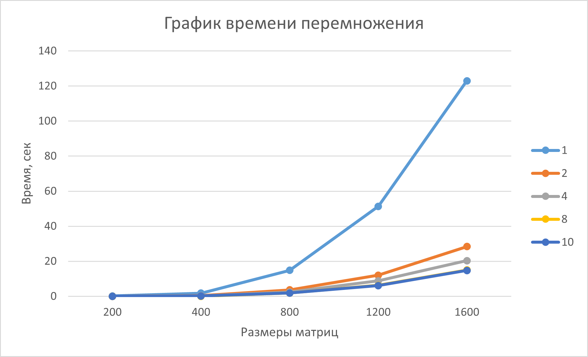

# Шалимова Альбина Алексеевна, 6213 группа
# Лабораторная работа №3


В третьей лабораторной работе нужно было распаралеллить перемножение матриц из первой лабораторной работы с помощью OpenMPI. Дальше необходимо было провести серию тестов с разными размерами матриц и разным количеством потоков, после чего - сформулировать вывод.


## Исходный код
В отличии от второй лабораторной работы, в третьей пришлось внести довольно много изменений, чтобы добится распаралелливания.
- Подключен заголовочный файл *<mpi.h>*;
- Изменен код перемножения матриц. Каждый процесс перемножает свои определенные строки, а потом отправляет их нулевому процессу, где локальные результаты собираются в конечную матрицу;
- Матрицы теперь создаются не через метод класса, а через отдельную функцию, обеспечивающую передачу сгенерированных матриц каждому процессу;
- Небольшие корректировки функций записи матриц в файлы - эту задачу выполняет только нулевой процесс, чтобы матрицы каждый раз не перезаписывались разными процессами;
- Видоизменен main();
- Вместо библиотеки *<chrono>* для подсчета времени, затраченного на перемножение матриц, была использована функция из библиотеки *<mpi.h>* - MPI_Wtime().

### CSquareMatrix.cpp
```cpp
#include <mpi.h>


template <typename T, size_t Size1, size_t Size2>
CSquareMatrix<T, Size1> multiplyMatricesMPI(const CSquareMatrix<T, Size1>& mat1, const CSquareMatrix<T, Size2>& mat2, int rank, int size) {
    if (Size1 != Size2) {
       throw std::invalid_argument("Matrices must have the same size for multiplication");
    }
    
    CSquareMatrix<T, Size1> result;

    int rows = Size1 / size;
    int remains = Size1 % size;

    int start_row = rank * rows;
    if (rank < remains) {
        start_row += rank;
        rows++;
    } else {
        start_row += remains;
    }
    int end_row = start_row + rows;

    CSquareMatrix<T, Size1> local_result;
    for (size_t i = start_row; i < end_row; i++) {
        for (size_t j = 0; j < Size1; j++) {
            T sum = 0;
            for (size_t k = 0; k < Size1; k++) {
                sum += mat1[i][k]*mat2[k][j];
            }
            local_result[i][j] = sum;
        }
    }

    if (rank == 0) {
        for (size_t i = start_row; i < end_row; i++) {
            for (size_t j = 0; j < Size1; j++) {
                result[i][j] = local_result[i][j];
            }
        }

        for (int process = 1; process < size; process++) {
            int new_rows = Size1 / size;
            int process_rows_start = process * new_rows;
            int process_rows = 0;

            if (process_rows_start < remains) {
                process_rows_start += process;
                process_rows = new_rows + 1;
            } else {
                process_rows_start += remains;
                process_rows = new_rows;
            }

            MPI_Recv(&result[process_rows_start][0], process_rows * Size1, MPI_INT, process, 0, MPI_COMM_WORLD, MPI_STATUS_IGNORE);
        }

    } else {
        MPI_Send(&local_result[start_row][0], rows * Size1, MPI_INT, 0, 0, MPI_COMM_WORLD);
    }

    return result;
}


template <typename T, size_t Size>
void generateFullMatrixMPI(CSquareMatrix<T, Size>& mat, int rank, int size) {
    if (rank == 0) {
        mat.generateFullMatrix();

        for (size_t i = 1; i < size; i++) {
            MPI_Send(&mat[0][0], Size * Size, MPI_INT, i, 0, MPI_COMM_WORLD);
        }

    } else {
        MPI_Recv(&mat[0][0], Size * Size, MPI_INT, 0, 0, MPI_COMM_WORLD, MPI_STATUS_IGNORE);
    }
}


template <typename T, size_t Size1, size_t Size2>
void writeOriginalMatricesFile(const CSquareMatrix<T, Size1>& mat1, const CSquareMatrix<T, Size2>& mat2, int rank) {
    if (Size1 != Size2) {
            throw std::invalid_argument("Matrices must have the same size for multiplication");
    }

    if (rank == 0) {
        std::ofstream file("original_matrices.txt");
        if (!file.is_open()) {
            throw std::runtime_error("Couldn't open the file");
        }

        for (size_t i = 0; i < Size1; i++) {
            for (size_t j = 0; j < Size1; j++) {
                file << mat1[i][j] << " ";
            }
            file << "\n";
        }

        file << '\n';

        for (size_t i = 0; i < Size2; i++) {
            for (size_t j = 0; j < Size2; j++) {
                file << mat2[i][j] << " ";
            }
            file << "\n";
        }

        file.close();
    }
}


template <typename T, size_t Size1, size_t Size2>
void multiplitionCheckMPI(const CSquareMatrix<T, Size1>& mat1, const CSquareMatrix<T, Size2>& mat2, int rank, int size) {
    if (Size1 != Size2) {
            throw std::invalid_argument("Matrices must have the same size for multiplication");
    }

    CSquareMatrix<int, Size1> res_mat;
    MPI_Barrier(MPI_COMM_WORLD);
    auto start_multiplication = MPI_Wtime();
    res_mat = multiplyMatricesMPI(mat1, mat2, rank, size);
    MPI_Barrier(MPI_COMM_WORLD);
    auto end_multiplication = MPI_Wtime();

    if (rank == 0) {
        std::ofstream file("result_matrix.txt");
        if (!file.is_open()) {
            throw std::runtime_error("Couldn't open the file");
        }

        auto time_multiplication = (end_multiplication - start_multiplication) * 1000000;
        file << "Multiplication time: " << time_multiplication << " microseconds\n";
        file << "Number of operations: " << (2*Size1 - 1)*Size1*Size1 << "\n";

        for (size_t i = 0; i < Size1; i++) {
            for (size_t j = 0; j < Size1; j++) {
                file << res_mat[i][j] << " ";
            }
            file << "\n";
        }

        file.close();
    }
}


int main(int argc, char* argv[]) {

    MPI_Init(&argc, &argv);

    int size, rank;
    MPI_Comm_rank(MPI_COMM_WORLD, &rank);
    MPI_Comm_size(MPI_COMM_WORLD, &size);

    CSquareMatrix<int, 1600> mat1;
    CSquareMatrix<int, 1600> mat2;
    generateFullMatrixMPI(mat1, rank, size);
    generateFullMatrixMPI(mat2, rank, size);

    try {
        writeOriginalMatricesFile(mat1, mat2, rank);
        multiplitionCheckMPI(mat1, mat2, rank, size);
        system("python verification_of_the_result.py");
        if (rank == 0) {
        std::cout << "Matrices are multiplied";
        }
    } catch (const std::exception& e) {
        std::cerr << "Error: " << e.what();
    }

    MPI_Finalize();
}
```

## Результаты
### Для 1 потока
|   Размер матрицы  |     Время выполнения     | Количество операций | Результат проверки |
|:-----------------:|:------------------------:|:-------------------:|:------------------:|
|200 на 200         |  212465 микросекунд      | 15960000            | Matrices are equal |
|400 на 400         |  1844070 микросекунд     | 127840000           | Matrices are equal |
|800 на 800         |  14884200 микросекунд    | 1023360000          | Matrices are equal |
|1200 на 1200       |  51382400 микросекунд    | 3454560000          | Matrices are equal |
|1600 на 1600       |  122941000 микросекунд   | 8189440000          | Matrices are equal |

### Для 2 потоков
|   Размер матрицы  |     Время выполнения     | Количество операций | Результат проверки |
|:-----------------:|:------------------------:|:-------------------:|:------------------:|
|200 на 200         |  67124 микросекунд       | 15960000            | Matrices are equal |
|400 на 400         |  411924 микросекунд      | 127840000           | Matrices are equal |
|800 на 800         |  3662390 микросекунд     | 1023360000          | Matrices are equal |
|1200 на 1200       |  12093300 микросекунд    | 3454560000          | Matrices are equal |
|1600 на 1600       |  28378000 микросекунд    | 8189440000          | Matrices are equal |

### Для 4 потоков
|   Размер матрицы  |     Время выполнения     | Количество операций | Результат проверки |
|:-----------------:|:------------------------:|:-------------------:|:------------------:|
|200 на 200         |  38898 микросекунд       | 15960000            | Matrices are equal |
|400 на 400         |  308180 микросекунд      | 127840000           | Matrices are equal |
|800 на 800         |  2371280 микросекунд     | 1023360000          | Matrices are equal |
|1200 на 1200       |  8879470 микросекунд     | 3454560000          | Matrices are equal |
|1600 на 1600       |  20386100 микросекунд    | 8189440000          | Matrices are equal |

### Для 8 потоков
|   Размер матрицы  |     Время выполнения     | Количество операций | Результат проверки |
|:-----------------:|:------------------------:|:-------------------:|:------------------:|
|200 на 200         |  27465 микросекунд       | 15960000            | Matrices are equal |
|400 на 400         |  23452 микросекунд       | 127840000           | Matrices are equal |
|800 на 800         |  1872300 микросекунд     | 1023360000          | Matrices are equal |
|1200 на 1200       |  6325110 микросекунд     | 3454560000          | Matrices are equal |
|1600 на 1600       |  15043000 микросекунд    | 8189440000          | Matrices are equal |

### Для 10 потоков
|   Размер матрицы  |     Время выполнения     | Количество операций | Результат проверки |
|:-----------------:|:------------------------:|:-------------------:|:------------------:|
|200 на 200         |  23844 микросекунд       | 15960000            | Matrices are equal |
|400 на 400         |  221862 микросекунд      | 127840000           | Matrices are equal |
|800 на 800         |  1870510 микросекунд     | 1023360000          | Matrices are equal |
|1200 на 1200       |  6162330 микросекунд     | 3454560000          | Matrices are equal |
|1600 на 1600       |  14755300 микросекунд    | 8189440000          | Matrices are equal |

## Выводы

Как видно из графика значительное ускорение программы произошло только при переходе с 1 процесса до 2. В остальных случаях, хотя и есть улучшения по времени, они не такие большие. При 8 потоках и 10 разницы вообще не наблюдается. Но, если сравнивать с результатами, полученными при распаралелливании с OpenMP, то можно заметить насколько сильно оптимизировался код. Например, на 4 процессах OpenMP перемножает матрицы размерами 1600 на 1600 за ~50 секунд, а OpenMPI - за ~20 секунд.
