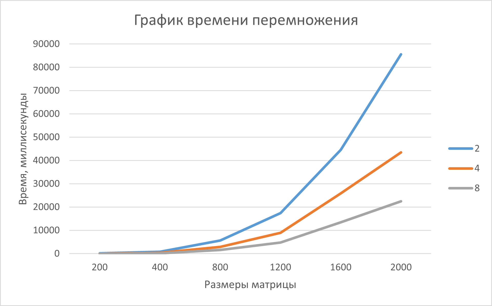

# Шалимова Альбина Алексеевна, 6213 группа
# Лабораторная работа №5


В 5 лабораторной работе нужно было запустить код 3 лабораторной работы на супер компьютере *"Сергей Королев"*. Дальше сделать вывод на основе полученных результатов.


## Исходный код
Лабораторная работа была выполнена на стационарном компьютере в 18 корпусе. Из-за ограниченного времени, когда был доступ к университетской сети, я и еще 2 человека объединились в группу. Мы запускали один скрипт на своих личных аккаунтах. Хоть код и отличается оформлением от моего, он все еще сохраняет логику распаралелливания перемножения матриц по технологии OpenMPI. Самое большое отличие от 3 лабораторной работы - наличие скрипта вместо CMakeLists.txt. В нем прописано:
- Номер задачи в системной очереди;
- Сколько процессов выделить;
- Через какое время прекратить работу программы, даже если она еще выполняется;
- Запускает программу.

Команды, которые вводились в терминал:
1. *mpicxx -std=c++11 lab3.cpp -o matMulMPI* - компилирование программы после изменения размеров матриц;
2. *sbatch lab3.slurm* - запуск скрипта;
3. *cat out4.out* - вывод результата перемножения матриц в термина.


### lab3.cpp
```cpp
#include <mpi.h>
#include <chrono>
#include <fstream>
#include <cstdlib>
#include <iostream>
#include <array>
#include <algorithm>
#include <random>      
#include <type_traits>

template <typename T, size_t N>
class Matrix{
    std::array<T, N*N> arr;
    public:
    Matrix(): arr{}{}
    Matrix(const T val){
        arr.fill(val);
    }

    Matrix(const T& min, const T& max, const unsigned int seed){
        std::mt19937 gen(seed);
        std::uniform_int_distribution<T> dist(min, max);
        for(size_t i = 0; i < N*N; i++){
            arr[i] = dist(gen);
        }
    }

    size_t size()const{
        return N;
    }
    
    T* data(){
        return arr.data();
    }

    const T* data() const{
        return arr.data();
    }

    T& operator()(const size_t i, const size_t j){
        return arr[i*N + j];
    }

    const T& operator()(const size_t i, const size_t j) const{
        return arr[i*N + j];
    }

    Matrix operator+(const Matrix& m)const{
        Matrix<T, N> res;
        for (size_t i = 0; i < N; i++){
            for(size_t j = 0; j < N; j++)
                res(i, j) = (*this)(i, j) + m(i, j);
        }
        return res;
    }

    Matrix<T, N> operator*(const T c) const{
        Matrix<T, N> res;
        for (size_t i = 0; i < N; i++){
            for(size_t j = 0; j < N; j++)
                res(i, j) = (*this)(i, j)*c;
        }
        return res;
    }

    friend Matrix<T, N> operator*(const T c, const Matrix<T, N>& m){
        return m*c;
    }

    Matrix<T, N> operator*(const Matrix& m) const{
        Matrix<T, N> res;
        for (int i = 0; i < N; i++) {
            for (int j = 0; j < N; j++) {
                for (int k = 0; k < N; k++) {
                    res(i, j) += (*this)(i, k) * m(k, j);
                }
            }
        }
        return res;
    }

    Matrix<T, N> mpi_multi(const Matrix<T, N>& m) const {
        int rank, size;
        MPI_Comm_rank(MPI_COMM_WORLD, &rank);
        MPI_Comm_size(MPI_COMM_WORLD, &size);

        if (N % size != 0) {
            if (rank == 0)
                std::cerr << "Error\n";
            return Matrix<T, N>();
        }

        int rows = N / size;
        int start_row = rank * rows;

        Matrix<T, N> loc_res;
        
        for (int i = 0; i < N; i++)
            for (int j = 0; j < N; j++)
                loc_res(i, j) = 0;
        
        for (int i = start_row; i < start_row + rows; i++) {
            for (int j = 0; j < N; j++) {
                T sum = 0;
                for (int k = 0; k < N; k++) {
                    sum += (*this)(i, k) * m(k, j);
                }
                loc_res(i, j) = sum;
            }
        }

        Matrix<T, N> res;
        
        MPI_Datatype mpi_type = MPI_INT;

        MPI_Reduce(loc_res.data(), res.data(), N * N, mpi_type, MPI_SUM, 0, MPI_COMM_WORLD);

        return res;
    }
    
    friend std::ostream& operator<<(std::ostream& os, const Matrix<T, N>& m){
        for(size_t i = 0; i<N; i++){
            for(size_t j = 0; j < N; j++){
                os << m(i, j) << " ";
            }
            os << "\n";
        }
        return os;
    }

};

int main(int argc, char** argv){
    MPI_Init(&argc, &argv);
    
    int rank;
    MPI_Comm_rank(MPI_COMM_WORLD, &rank);
    
    const size_t N = 1600;
    Matrix<int, N> m1, m2;
    
    if (rank == 0) {
        m1 = Matrix<int, N>(1, 100, 8);
        m2 = Matrix<int, N>(-134, 670, 45);
        
        std::ofstream out_begin("begin.txt");
        if (out_begin.is_open()) {
            out_begin << "Matrix A:\n" << m1 << "Matrix B:\n" << m2;
            out_begin.close();
        }
    }
    
    MPI_Bcast(m1.data(), N * N, MPI_INT, 0, MPI_COMM_WORLD);
    MPI_Bcast(m2.data(), N * N, MPI_INT, 0, MPI_COMM_WORLD);
    
    auto start = std::chrono::high_resolution_clock::now();
    auto res = m1.mpi_multi(m2);
    auto end = std::chrono::high_resolution_clock::now();
    auto time = std::chrono::duration_cast<std::chrono::microseconds>(end - start);
    if (rank==0) {
	std::cout << N << "   /n   ";
	std::cout << time.count()/1000.0 << " ms/n";
    }
    if (rank == 0) {
        
        std::ofstream out("end.txt");
        if (out.is_open()) {
            out << "Result Matrix:\n" << res << "\n";
            out << "Matrix's size: " << N << "x" << N << "\n";
            out << "Time: " << time.count()/1000.0 << " ms" << std::flush; 
            out.close();
        }
    }
    
    MPI_Finalize();
    return 0;
}
```
### lab3.slurm
``` txt
#!/bin/bash
#SBATCH --job-name=run8
#SBATCH --ntasks-per-node=8
#SBATCH --time=00:30:00

mpirun ./matMulMPI
```

## Результаты
### 2 потока
|   Размер матрицы  |     Время выполнения     | Количество операций | 
|:-----------------:|:------------------------:|:-------------------:|
|200 на 200         |  960000 микросекунд      | 15960000            | 
|400 на 400         |  7620000 микросекунд     | 127840000           |
|800 на 800         |  56250000 микросекунд    | 1023360000          |
|1200 на 1200       |  174440000 микросекунд   | 3454560000          |
|1600 на 1600       |  445720000 микросекунд   | 8189440000          |
|2000 на 2000       |  856100000 микросекунд   | 15996000000         |

### 4 потока
|   Размер матрицы  |     Время выполнения     | Количество операций |
|:-----------------:|:------------------------:|:-------------------:|
|200 на 200         |  490000 микросекунд      | 15960000            |
|400 на 400         |  38800000 микросекунд    | 127840000           |
|800 на 800         |  29360000 микросекунд    | 1023360000          |
|1200 на 1200       |  89740000 микросекунд    | 3454560000          |
|1600 на 1600       |  258250000 микросекунд   | 8189440000          |
|2000 на 2000       |  434160000 микросекунд   | 15996000000         |

### 8 потоков
|   Размер матрицы  |     Время выполнения     | Количество операций |
|:-----------------:|:------------------------:|:-------------------:|
|200 на 200         |  250000 микросекунд      | 15960000            |
|400 на 400         |  19400000 микросекунд    | 127840000           |
|800 на 800         |  15470000 микросекунд    | 1023360000          |
|1200 на 1200       |  47970000 микросекунд    | 3454560000          |
|1600 на 1600       |  134110000 микросекунд   | 8189440000          |
|2000 на 2000       |  225180000 микросекунд   | 15996000000         |


## Выводы

Как видно из результатов, при увеличении количества процессов в 2 раза, скорость выполнения программы уменьшается в 2 раза. Если же сравнивать с результатами 3 лабораторной работы, то особых изменений нет. При восьми потоках ноутбук перемножает матрицы 1600 на 1600 за ~20000 миллисекунд, а "Сергей Королев" ~15000. И это ни в какое сравнение не идет с результатами, полученными по технологии CUDA.