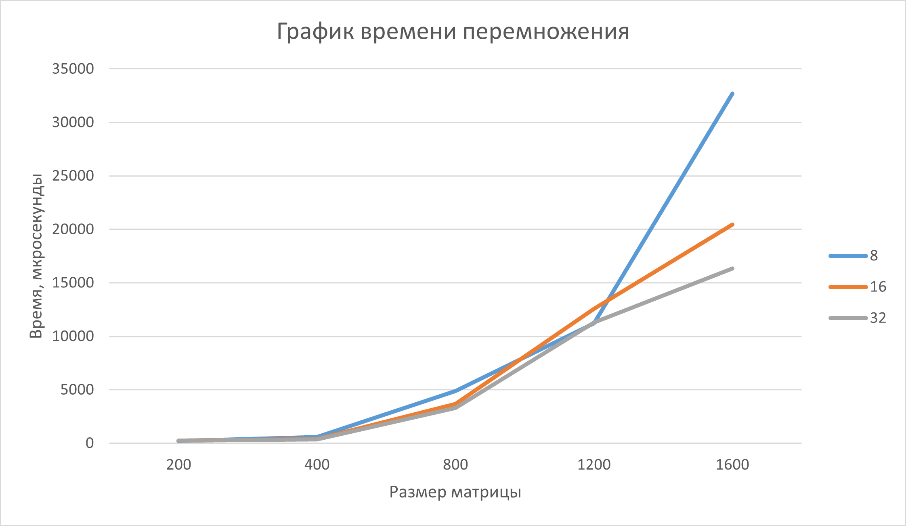

# Шалимова Альбина Алексеевна, 6213 группа
# Лабораторная работа №4


В четвертой лабораторной работе нужно было распаралеллить перемножение матриц из первой лабораторной работы с помощью технологии CUDA. Дальше необходимо было провести серию тестов с разными размерами матриц и разным количеством блоков в гринде, после чего - сформулировать вывод.


## Исходный код
Код четвертой лабораторной работы претерпел больше всего изменений. Для работы с CUDA необходим процессор Nvidia, а на моем ноутбуке установлен AMD Ryzen, из-за чего пришлось использовать расширение Google Colab. В дополнение пришлось немного переделать изначальный класс матриц, так как в нем использовался *std::array*, который задействует стек. Для перемножения матриц размером больше 400 на 400 в *CMakeLists.txt* приходилось вручную увеличивать размер стека. В Google Colab *CMakeLists.txt* трудно использовать, поэтому пришлось перейти с *std::array* на *std::vector*.

- Подключен заголовочный файл *<cuda_runtime.h>*;
- Изменен класс матриц. Были добавлены методы обращения к элементу, превращающие двумерный поиск в одномерный;
- Модифицирована функция перемножения матриц. Каждый из потоков путем одномерного перемножения строки и столбца исходных матрциц вычисляет элемент результирующей матрицы. Если было выделено больше потоков, чем элементов матрицы, то благодаря проверке *if (row < N && col < N)* они будут проигнорированы;
- Функции записи матриц в файлы вернулись к первоначальному виду (для OenMPI их пришлось видоизменить);
- Функция проверки перемножения теперь не только замеряет время, но и выделяет память в GPU под матрицы, передает туда исходные матрицы, умножает их и переносит резултьтат с GPU на CPU;
- Для измерения времени использовались встроенные в CUDA функции.  


### CSquareMatrix.cpp / colab.ipynb
```cpp
%%writefile CSquareMatrixCUDA.cu
#include <vector>
#include <cuda_runtime.h>


class CSquareMatrix {
    private:
    size_t size_;
    std::vector<int> data_;
    
    public:
    CSquareMatrix(size_t size): size_(size), data_(size * size) {}


    int* getData() {
        return data_.data();
    }


    const int* getData() const {
        return data_.data();
    }


    int& operator() (size_t row, size_t col) {
        return data_[row * size_ + col];
    }


    const int& operator() (size_t row, size_t col) const {
        return data_[row * size_ + col];
    }


    size_t getSize() const {
        return size_;
    }


    void generateFullMatrix() {
        static std::random_device rd;
        static std::mt19937 gen(rd());
        std::uniform_int_distribution<> dis(1, 10);

        for (auto& num : data_) {
            num = dis(gen);
        }
    }
};


__global__ void multiplyMatricesCUDA(const int* A, const int* B, int* C, int N) {
    int row = blockIdx.y * blockDim.y + threadIdx.y;
    int col = blockIdx.x * blockDim.x + threadIdx.x;
    
    if (row < N && col < N) {
        int sum = 0;
        for (int k = 0; k < N; k++) {
            sum += A[row * N + k] * B[k * N + col];
        }

        C[row * N + col] = sum;
    }
}


void writeOriginalMatricesFile(const CSquareMatrix& A, const CSquareMatrix& B) {
    if (A.getSize() != B.getSize()) {
            throw std::invalid_argument("Matrices must have the same size for multiplication");
    }

    std::ofstream file("original_matrices.txt");
    if (!file.is_open()) {
        throw std::runtime_error("Couldn't open the file");
    }

    size_t size = A.getSize();
    for (size_t i = 0; i < size; i++) {
        for (size_t j = 0; j < size; j++) {
            file << A(i, j) << " ";
        }

        file << "\n";
    }

    file << '\n';

    for (size_t i = 0; i < size; i++) {
        for (size_t j = 0; j < size; j++) {
            file << B(i, j) << " ";
        }
        file << "\n";
    }

    file.close();
}


void multiplicationCheckCUDA(const CSquareMatrix& A, const CSquareMatrix& B) {
    if (A.getSize() != B.getSize()) {
            throw std::invalid_argument("Matrices must have the same size for multiplication");
    }

    int N = A.getSize();
    const size_t bytes = N * N * sizeof(int);

    int *d_A, *d_B, *d_C;
    cudaMalloc(&d_A, bytes);
    cudaMalloc(&d_B, bytes);
    cudaMalloc(&d_C, bytes);

    cudaMemcpy(d_A, A.getData(), bytes, cudaMemcpyHostToDevice);
    cudaMemcpy(d_B, B.getData(), bytes, cudaMemcpyHostToDevice);


    dim3 blockSize(8, 8);
    dim3 gridSize((N + blockSize.x- 1) / blockSize.x, (N + blockSize.y- 1) / blockSize.y);

    cudaEvent_t start, stop;
    cudaEventCreate(&start);
    cudaEventCreate(&stop);

    cudaEventRecord(start);
    multiplyMatricesCUDA<<<gridSize, blockSize>>>(d_A, d_B, d_C, N);
    cudaEventRecord(stop);

    cudaEventSynchronize(stop);

    float time_multiplication;
    cudaEventElapsedTime(&time_multiplication, start, stop);

    CSquareMatrix result(N);
    cudaMemcpy(result.getData(), d_C, bytes, cudaMemcpyDeviceToHost);

    cudaFree(d_A);
    cudaFree(d_B);
    cudaFree(d_C);
    cudaEventDestroy(start);
    cudaEventDestroy(stop);

    std::ofstream file("result_matrix.txt");
    if (!file.is_open()) {
        throw std::runtime_error("Couldn't open the file");
    }

    file << "Multiplication time: " << time_multiplication * 1000 << " microseconds\n";
    file << "Number of operations: " << (2 * N - 1) * N * N << "\n";

    for (size_t i = 0; i < N; i++) {
        for (size_t j = 0; j < N; j++) {
            file << result(i, j) << " ";
        }

        file << "\n";
    }

    file.close();
}


int main() {
    int N = 200;

    CSquareMatrix h_A(N), h_B(N);
    h_A.generateFullMatrix();
    h_B.generateFullMatrix();

    try {
        multiplicationCheckCUDA(h_A, h_B);
        std::cout << "Matrices are multiplied\n";
    } catch (const std::exception& e) {
        std::cerr << "Error: " << e.what();
    }
}
```

## Результаты
### 8 на 8 потоков на блок
|   Размер матрицы  |     Время выполнения     | Количество операций | Результат проверки |
|:-----------------:|:------------------------:|:-------------------:|:------------------:|
|200 на 200         |  208 микросекунд         | 15960000            | Matrices are equal |
|400 на 400         |  588 микросекунд         | 127840000           | Matrices are equal |
|800 на 800         |  4883 микросекунд        | 1023360000          | Matrices are equal |
|1200 на 1200       |  11208 микросекунд       | 3454560000          | Matrices are equal |
|1600 на 1600       |  32710 микросекунд       | 8189440000          | Matrices are equal |

### 16 на 16 потоков на блок
|   Размер матрицы  |     Время выполнения     | Количество операций | Результат проверки |
|:-----------------:|:------------------------:|:-------------------:|:------------------:|
|200 на 200         |  255 микросекунд         | 15960000            | Matrices are equal |
|400 на 400         |  415 микросекунд         | 127840000           | Matrices are equal |
|800 на 800         |  3688 микросекунд        | 1023360000          | Matrices are equal |
|1200 на 1200       |  12582 микросекунд       | 3454560000          | Matrices are equal |
|1600 на 1600       |  20463 микросекунд       | 8189440000          | Matrices are equal |

### 32 на 32 потоков на блок
|   Размер матрицы  |     Время выполнения     | Количество операций | Результат проверки |
|:-----------------:|:------------------------:|:-------------------:|:------------------:|
|200 на 200         |  231 микросекунд         | 15960000            | Matrices are equal |
|400 на 400         |  376 микросекунд         | 127840000           | Matrices are equal |
|800 на 800         |  3306 микросекунд        | 1023360000          | Matrices are equal |
|1200 на 1200       |  11297 микросекунд       | 3454560000          | Matrices are equal |
|1600 на 1600       |  16347 микросекунд       | 8189440000          | Matrices are equal |


## Выводы

За все 4 лабораторные работы данные результаты являются наилучшими. По технологии OpenMPI при 10 потоках матрицы размерами 1600 на 1600 пермножаются за 14755300 микросекунд, что в 900 раз дольше, чем перемножение тех же матриц с помощью CUDA. Если же сравнивать результаты между размным количеством потоков в блоке, то все примерно одинаково эффективно. Даже когда в блоке 64 потока, разница заметна только при размере матрицы 1600 на 1600. И то, возможно, это просто наихудший результат.
