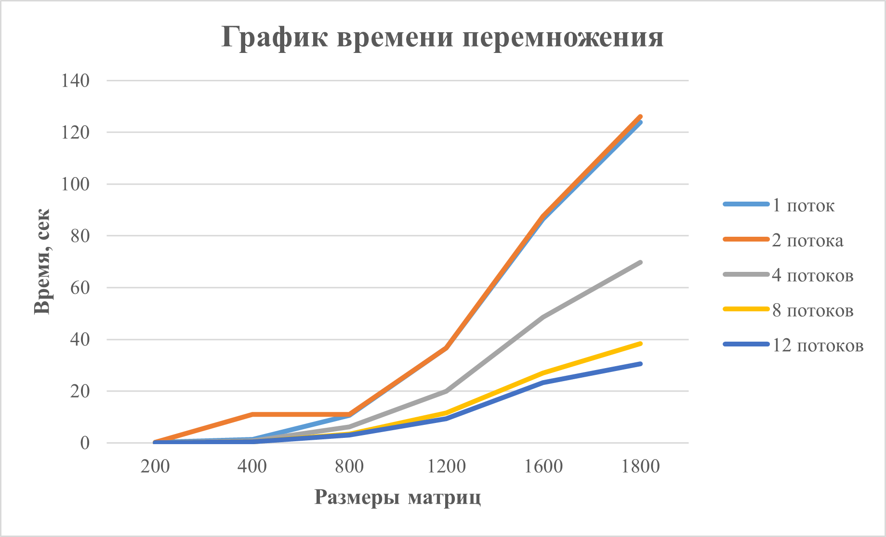

# Шалимова Альбина Алексеевна, 6213 группа
# Лабораторная работа №2


Во второй лабораторной работе нужно было распаралеллить перемножение матриц из первой лабораторной работы с помощью OpenMP. После этого необходимо было провести серию тестов с разными размерами матриц и разным количеством потоков, после чего - сделать вывод.


## Исходный код
Небольшие изменения от первоначального кода:
- подключен заголовочный файл *<omp.h>*
- добавлена директива *#pragma omp parallel* for перед циклом for
- в main с помощью *omp_set_num_threads(n)* указывается количество используемых потоков
### CSquareMatrix.cpp
```cpp
#include <omp.h>

template<typename T, size_t Size1, size_t Size2>
CSquareMatrix<T, Size1> multiplyMatrices(const CSquareMatrix<T, Size1>& mat1, const CSquareMatrix<T, Size2>& mat2) {
    if (Size1 != Size2) {
        throw std::invalid_argument("Matrices must have the same size for multiplication");
    }
    
    CSquareMatrix<T, Size1> result;

    #pragma omp parallel for
    for (int i = 0; i < Size1; i++) {
        for (int j = 0; j < Size1; j++) {
            for (int k = 0; k < Size1; k++) {
                result[i][j] += mat1[i][k]*mat2[i][j];
            }
        }
    }
    return result;
}

int main() {
    omp_set_num_threads(12);

    CSquareMatrix<int, 1800> mat1;
    mat1.generateFullMatrix();
    CSquareMatrix<int, 1800> mat2;
    mat2.generateFullMatrix();
    try {
        writeOriginalMatricesFile(mat1, mat2);
        multiplitionCheck(mat1, mat2);
        system("python verification_of_the_result.py");
    } catch (const std::exception& e) {
        std::cerr << "Error: " << e.what();
    }
}
```
## Результаты
### Для 1 потока
|   Размер матрицы  |     Время выполнения     | Количество операций | Результат проверки |
|:-----------------:|:------------------------:|:-------------------:|:------------------:|
|200 на 200         |  186138 микросекунд      | 15960000            | Matrices are equal |
|400 на 400         |  1334793 микросекунд     | 127840000           | Matrices are equal |
|800 на 800         |  10707287 микросекунд    | 1023360000          | Matrices are equal |
|1200 на 1200       |  36620234 микросекунд    | 3454560000          | Matrices are equal |
|1600 на 1600       |  86533236 микросекунд    | 8189440000          | Matrices are equal |
|1800 на 1800       |  123886428 микросекунд   | 11660760000         | Matrices are equal |

### Для 2 потоков
|   Размер матрицы  |     Время выполнения     | Количество операций | Результат проверки |
|:-----------------:|:------------------------:|:-------------------:|:------------------:|
|200 на 200         |  181222 микросекунд      | 15960000            | Matrices are equal |
|400 на 400         |  1336095 микросекунд     | 127840000           | Matrices are equal |
|800 на 800         |  10975106 микросекунд    | 1023360000          | Matrices are equal |
|1200 на 1200       |  36681282 микросекунд    | 3454560000          | Matrices are equal |
|1600 на 1600       |  87658806 микросекунд    | 8189440000          | Matrices are equal |
|1800 на 1800       |  126170158 микросекунд   | 11660760000         | Matrices are equal |

### Для 4 потоков
|   Размер матрицы  |     Время выполнения     | Количество операций | Результат проверки |
|:-----------------:|:------------------------:|:-------------------:|:------------------:|
|200 на 200         |  117673 микросекунд      | 15960000            | Matrices are equal |
|400 на 400         |  833181 микросекунд      | 127840000           | Matrices are equal |
|800 на 800         |  6189787 микросекунд     | 1023360000          | Matrices are equal |
|1200 на 1200       |  20012564 микросекунд    | 3454560000          | Matrices are equal |
|1600 на 1600       |  48524487 микросекунд    | 8189440000          | Matrices are equal |
|1800 на 1800       |  69738842 микросекунд    | 11660760000         | Matrices are equal |

### Для 8 потоков
|   Размер матрицы  |     Время выполнения     | Количество операций | Результат проверки |
|:-----------------:|:------------------------:|:-------------------:|:------------------:|
|200 на 200         |  96256 микросекунд       | 15960000            | Matrices are equal |
|400 на 400         |  461765 микросекунд      | 127840000           | Matrices are equal |
|800 на 800         |  3421608 микросекунд     | 1023360000          | Matrices are equal |
|1200 на 1200       |  11498462 микросекунд    | 3454560000          | Matrices are equal |
|1600 на 1600       |  26935704 микросекунд    | 8189440000          | Matrices are equal |
|1800 на 1800       |  38415978 микросекунд    | 11660760000         | Matrices are equal |

### Для 12 потоков
|   Размер матрицы  |     Время выполнения     | Количество операций | Результат проверки |
|:-----------------:|:------------------------:|:-------------------:|:------------------:|
|200 на 200         |  110986 микросекунд      | 15960000            | Matrices are equal |
|400 на 400         |  453828 микросекунд      | 127840000           | Matrices are equal |
|800 на 800         |  2946597 микросекунд     | 1023360000          | Matrices are equal |
|1200 на 1200       |  9282888 микросекунд     | 3454560000          | Matrices are equal |
|1600 на 1600       |  23277936 микросекунд    | 8189440000          | Matrices are equal |
|1800 на 1800       |  30569978 микросекунд    | 11660760000         | Matrices are equal |

## Выводы

Как видно из графика между 1 потоком и 2 потоками практически нет никакого выигрыша в производительности. Вот уже на 4 потоках время выполнения задачи уменьшается практически вдвое для матриц каждого размера. Точно такое же увеличение в производительности видно при переходе с 4 до 8 потоков. По сравнению с 1 потоком, 8 потоков ускоряют программу в три раза. А вот дальше при переходе на 12 потоков такое значительное ускорение пропадает, и при маленьких размерах матриц (200 - 1200) разницы по времени нет. Следовательно, для увеличения производительности кода спокойно можно брать среднее количество потоков (4-8), так как если взять меньше, то получится тот же результат, что и без распаралелливания, а если взять больше, то по скорости все равно ничего не выйграем.
